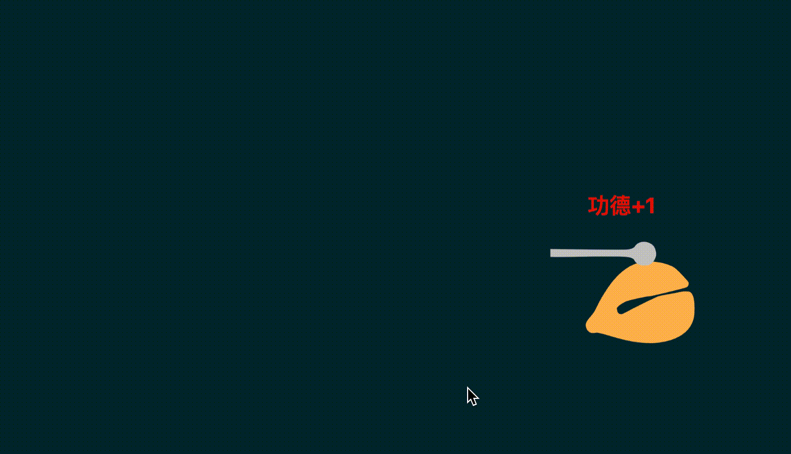
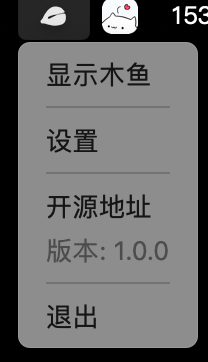

# 木鱼 - Mac桌面应用

一款简单而功能丰富的Mac电脑敲木鱼应用，基于Electron开发。

## 功能特点

- 极简设计，只显示木鱼和敲击棒
- 透明背景设计，无边框沉浸式体验
- 多种木鱼主题（传统木鱼的不同风格和颜色）
- 功德文字显示
- 常驻桌面功能（可置顶显示）
- 系统托盘支持和设置管理
- 窗口可拖动

## 功能介绍

### 主界面

木鱼应用主界面采用极简设计，透明无边框，让您专注于敲击木鱼的体验。木鱼动画流畅自然，敲击时有动画效果和音效反馈。



### 系统托盘功能

应用支持系统托盘，右键点击托盘图标可打开菜单，提供显示/隐藏窗口、设置、访问开源地址、查看版本号等功能。



### 设置界面

通过设置界面，您可以自定义木鱼的各种功能：
- 置顶显示：让木鱼窗口始终显示在其他窗口之上
- 自动敲击：启用后，木鱼将自动敲击，持续积累功德
- 显示功德文字：控制功德文字的显示与隐藏
- 自定义功德文字：修改敲击木鱼时显示的文字内容
- 选择木鱼主题：提供多种不同风格的木鱼主题可选择


## 安装运行

### 开发环境

1. 确保已安装Node.js环境
2. 克隆或下载本仓库
3. 在项目目录下运行以下命令：

```bash
# 安装依赖
npm install

# 运行应用
npm start
```

### 打包应用

```bash
# 为当前平台打包
npm run build

```

## 使用方法

1. 点击木鱼图标即可敲击木鱼，木鱼棒会自动执行敲击动画
2. 拖动应用顶部区域可以移动窗口位置
3. 右键点击系统托盘图标打开设置菜单，可以：
   - 显示/隐藏应用窗口
   - 置顶显示应用窗口
   - 开启/关闭自动敲击
   - 开启/关闭功德文字显示
   - 选择不同的木鱼主题
   - 退出应用
4. 关闭窗口时应用会最小化到系统托盘而不会退出

## 目录结构

```
woodfish/
├── assets/               # 资源文件
│   ├── audio/            # 音频文件
│   ├── images/           # 图片文件（包含高质量矢量图）
│   └── examples/         # 示例截图
├── src/                  # 源代码
│   ├── main.js           # 主进程
│   ├── preload.js        # 预加载脚本
│   ├── index.html        # 主界面HTML
│   ├── renderer.js       # 渲染进程脚本
│   ├── styles.css        # 样式表
│   ├── settings.html     # 设置页面HTML
│   └── settings.css      # 设置页面样式表
├── package.json          # 项目配置
└── README.md             # 项目说明
```

## 技术栈

- Electron
- JavaScript
- HTML5/CSS3
- SVG/矢量图动画

## 未来计划

- [x] 设置窗口可拖动
- [x] 托盘菜单显示开源地址和版本号
- [ ] 更多木鱼主题
- [ ] 自定义背景
- [ ] 多语言支持
- [ ] 数据导入导出
- [ ] 快捷键支持
- [ ] 启动时自动运行选项 